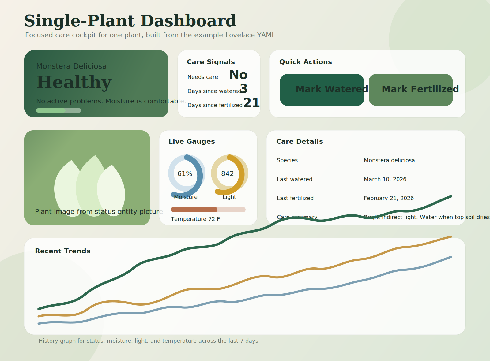
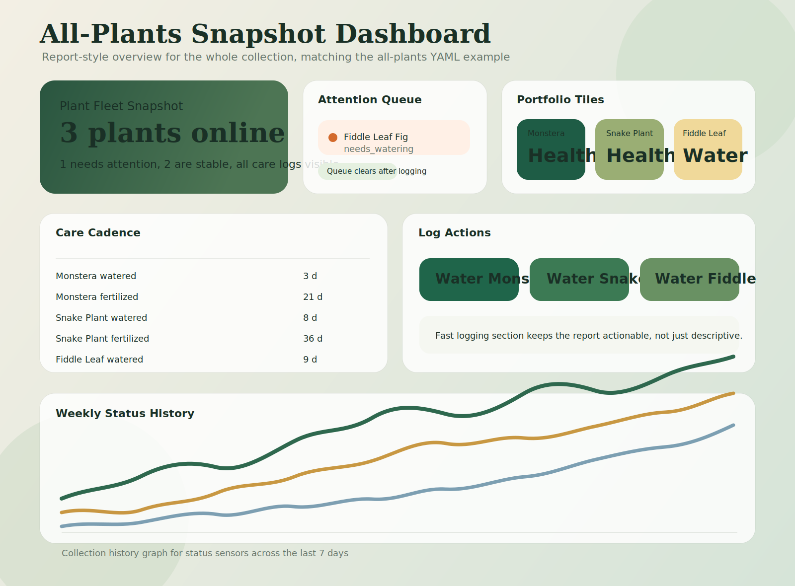

# Plant Guardian

Plant Guardian is a Home Assistant custom integration for tracking plant health and care in one place. It combines optional moisture, light, and temperature sensors with manual watering and fertilizing logs so each plant gets a clear, dashboard-friendly status.


## Dashboard Gallery

### Auto-Generated Dashboard Strategy

Plant Guardian now ships with a first-pass Lovelace strategy that can discover the user's real Plant Guardian entities and build the dashboard from that data.

It creates:

- One snapshot view for the whole collection
- One detail view per plant
- Automatic cards for moisture, light, and temperature only when those sensors exist
- Action buttons and care details from the user's live Home Assistant entities

To use it:

1. Restart Home Assistant after updating Plant Guardian.
2. Add a Lovelace resource of type `JavaScript module` pointing to `/api/plant_guardian/frontend/plant-guardian-dashboard-strategy.js`.
3. Create a new dashboard in YAML mode.
4. Paste this dashboard config:

```yaml
strategy:
  name: custom:plant-guardian-auto
```

This strategy is intentionally conservative for the first version. It focuses on reliable discovery and useful defaults rather than deep customization.

### Single-Plant Dashboard



Use [examples/plant_guardian_single_plant_dashboard.yaml](examples/plant_guardian_single_plant_dashboard.yaml) when you want one focused care cockpit for a specific plant.

It is designed for:

- A large hero card with the plant image and current status
- Quick watering and fertilizing actions
- Gauges for moisture, light, and temperature
- Care details and a seven-day history graph

### All-Plants Snapshot Dashboard



Use [examples/plant_guardian_report_dashboard.yaml](examples/plant_guardian_report_dashboard.yaml) when you want a report-style overview for the full plant collection.

It is designed for:

- A triage-first attention queue
- Portfolio tiles for all plants
- Watering and fertilizing age at a glance
- Quick logging buttons and a collection-wide history view

### Starter Bundle

If you want a lightweight starter that contains both a snapshot view and a single plant view in one file, use [examples/plant_guardian_dashboard.yaml](examples/plant_guardian_dashboard.yaml).

## What It Does Today

For each plant you add, Plant Guardian currently:

- Creates a dedicated device in Home Assistant for that plant
- Tracks plant status from optional moisture, light, and temperature sensor entities
- Logs watering and fertilizing with built-in button entities
- Supports backdated watering and fertilizing logs through Home Assistant services
- Stores the last watered and last fertilized timestamps between restarts
- Exposes a main status sensor with dashboard-friendly attributes
- Creates binary sensors for `problem` and `needs care`
- Optionally pulls image and care profile data from the Home Assistant OpenPlantbook integration

This is a UI-based integration and is added through `Settings` -> `Devices & services`.

## Entities Created

Every plant creates these entities:

- `Status` sensor
- `Days Since Watered` sensor
- `Days Since Fertilized` sensor
- `Problem` binary sensor
- `Needs Care` binary sensor
- `Watered Now` button
- `Fertilized Now` button

The integration also exposes these services:

- `plant_guardian.mark_watered`
- `plant_guardian.mark_fertilized`

If you attach source sensors, Plant Guardian also creates:

- `Moisture` sensor
- `Light` sensor
- `Temperature` sensor

Home Assistant generates the final entity IDs from your plant name.

## Status Logic

The main status sensor reports one of these values:

- `healthy`
- `dry`
- `low_light`
- `cold`
- `hot`
- `needs_watering`
- `needs_fertilizer`
- `needs_care`
- `unknown`

Status priority matches the current coordinator logic:

1. If sensor entities are configured but all are unavailable, status becomes `unknown`.
2. If moisture is below the configured minimum, status becomes `dry`.
3. If light is below the configured minimum, status becomes `low_light`.
4. If temperature is below the configured minimum, status becomes `cold`.
5. If temperature is above the configured maximum, status becomes `hot`.
6. If no active sensor problem exists, watering and fertilizing intervals are evaluated.

That means environmental problems take priority over routine reminder states.

## Status Attributes

The `Status` sensor exposes these useful attributes:

- `problem`
- `needs_care`
- `tags`
- `last_watered`
- `last_fertilized`
- `days_since_watered`
- `days_since_fertilized`
- `image`
- `image_source`
- `species`
- `care_summary`
- `care_source`
- `moisture`
- `light`
- `temperature`
- `moisture_min`
- `light_min`
- `temp_min`
- `temp_max`
- `watering_interval_days`
- `fertilizing_interval_days`

These are useful for Lovelace cards, badges, templates, and automations.

## Backdated Care Logging

If you watered or fertilized a plant earlier and forgot to log it, use the Plant Guardian services from `Developer Tools` -> `Actions`.

- Choose `plant_guardian.mark_watered` or `plant_guardian.mark_fertilized`
- Target the Plant Guardian device or one of that plant's Plant Guardian entities
- Optionally fill in `occurred_on` with the date the care actually happened
- Leave `occurred_on` empty to log it right now

Example service call:

```yaml
action: plant_guardian.mark_watered
target:
  entity_id: sensor.monstera_deliciosa_status
data:
  occurred_on: "2026-03-19"
```

Backdated logs cannot be set to a future date.

## Using The Dashboard Examples

1. Create a new dashboard in Home Assistant.
2. Open the dashboard in YAML mode.
3. Paste in one of the example files from `examples/`.
4. Replace the sample entity IDs like `monstera_deliciosa` with your actual Plant Guardian entity slug.
5. Duplicate or remove plant cards to match your collection.

A few customization tips:

- If a plant does not expose moisture, light, or temperature entities, remove those cards from the single-plant dashboard.
- Adjust gauge thresholds to match the care ranges configured for that plant.
- For the report dashboard, keep one `status` sensor per plant in the care queue so the alert list stays clean.

## Installation

### HACS

1. Open HACS.
2. Go to `Integrations`.
3. Choose `Custom repositories` from the menu.
4. Add `https://github.com/bluedragon456/plant_guardian` as an `Integration`.
5. Install `Plant Guardian`.
6. Restart Home Assistant.

### Manual

1. Copy [custom_components/plant_guardian](custom_components/plant_guardian) into your Home Assistant `custom_components` directory.
2. Restart Home Assistant.

Minimum Home Assistant version in `hacs.json`: `2024.1.0`

## Setup

1. Go to `Settings` -> `Devices & services`.
2. Click `Add integration`.
3. Search for `Plant Guardian`.
4. Add one plant per config entry.

Current setup fields include:

- Plant name
- Species
- Image URL
- Enable OpenPlantbook sync
- OpenPlantbook PID override
- Use OpenPlantbook image when no manual image is set
- Use OpenPlantbook care thresholds when available
- Moisture sensor
- Light sensor
- Temperature sensor
- Minimum moisture threshold
- Minimum light threshold
- Minimum temperature threshold
- Maximum temperature threshold
- Watering interval in days
- Fertilizing interval in days

You can change all plant settings later from the integration options flow.

## OpenPlantbook Support

Plant Guardian integrates with Home Assistant's `openplantbook` services if that integration is available.

Current behavior:

- OpenPlantbook sync is optional and disabled by default
- If enabled, Plant Guardian can resolve plant details using the provided PID, species, or plant name
- It can use an OpenPlantbook image when you have not set a manual image URL
- It can use OpenPlantbook care thresholds when care values are returned
- Results are cached for 24 hours per plant configuration

If OpenPlantbook is enabled in Plant Guardian but the OpenPlantbook integration is not installed in Home Assistant, Plant Guardian still works, but live lookup data may be unavailable.

## Notes And Limits

- Sensor entities are optional. You can use Plant Guardian as a care logger even without plant sensors.
- Source sensor states must be numeric for threshold checks to work.
- The integration watches configured source sensors and refreshes when they change.
- Watering and fertilizing history begins when you first log those actions through Plant Guardian.
- The auto-generated strategy currently requires adding a Lovelace resource once before you create the dashboard.
- There is currently no YAML configuration path in this repo; the supported setup path is the config flow.

## Good Use Cases

Plant Guardian is a good fit if you want:

- One device per plant
- Manual care reminders without building helpers yourself
- Plant-specific dashboards and automations
- A reportable snapshot of the full plant collection
- Optional OpenPlantbook enrichment without making it mandatory

## Contributing

Issues and pull requests are welcome.

- Repository: <https://github.com/bluedragon456/plant_guardian>
- Issues: <https://github.com/bluedragon456/plant_guardian/issues>

## License

MIT
